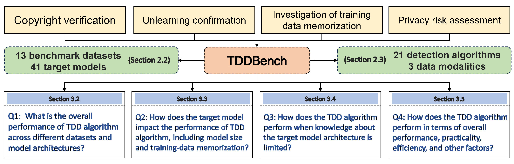

# TDDBench: A Benchmark for Training data detection

This code is the official implementation of TDDBench.

## Dependencies

```python

# python==3.8.19
pip install -r requirements.txt
```

## Why Do You Need TDDBench?

TDDBench is (to our best knowledge) **the most comprehensive training data detection benchmark**, where we evaluate latest **21** anomaly detection algorithms on **41 target models** spanning three data modalities: **tabular, image, and text**.

**Key Takeaways in 1 Minute**:

1. There is a significant performance gap between different types of TDD algorithms, with model-based TDD methods generally outperforming other types. However, the outperformance of the model-based TDD methods comes at the cost of building multiple reference models, which incurs high computational costs.
2. The memorization of training data is crucial for the TDD algorithm's performance, and larger target models usually exhibit this memorization phenomenon, making the TDD success rate higher.
3. The performance of TDD highly depends on knowing the underlying target model architecture. The TDD algorithm suffers from performance degradation in the case of an unknown target model.
4. There is no obvious winner among all methods. Lastly, none of the TDD algorithms are fully satisfactory, requiring testers to balance performance and efficiency based on real-world conditions. For specific experimental results, see Section 3 in our paper.

The Figure below provides an overview of our proposed TDDBench (see our paper for details).



---

## How to use TDDBench?

**Note**:  Before executing code, ensure that the path is set to ./benchmark. We provide the required data, trained models, and evaluation results on the **student** dataset as a demo.

### 1. First, to train target/shadow/reference models, you can run:

```python

bash train_base_model.sh
```

The checkpoints of the target, reference, and shadow models, along with the indexes of their training data, are stored in the **benchmark/meta_log** folder.

### 2. Perform training data detection

```python

python main.py --dataset student --target_model mlp --ref_model mlp --algs bench
```

The detection results are saved in the **benchmark/report_log** folder.

We categorize the 21 TDD algorithms into four types based on their algorithmic characteristics: metric-based, learning-based, model-based, and query-based. We support running one TDD algorithm or one type of TDD algorithm at a time. The correspondence between the algorithm name and the algorithm is as follows:

```python
metric: metric-based
learn: learning-based
model: model-based
query: query-based
bench/benchmark: all TDD methods
```

The parameters for training the target model and the parameters for the TDD algorithm are detailed in our paper. These parameters can be easily adjusted in the **benchmark/configs** directory.

## More details about TDDBench

### Datasets

In our paper, we present the results of the TDD algorithm on 13 datasets sourced mainly from torchvision, huggingface, UCI Machine Learning Repository, and academic papers. Our benchmark will incorporate additional datasets in the future.

We have devised a logical schema to facilitate the inclusion of new datasets for evaluation. To load the purchase dataset and cifar10 dataset, run the following command:

```python

import sys
sys.path.insert(0, "../basic/")

from dataset import get_dataset
dataset0 = get_dataset("cifar10", '../data')
dataset1 = get_dataset("student", '../data')
```

**Note**: Datasets in torchvision and UCI repository can be downloaded automatically, whereas other datasets must be manually downloaded before being loaded.

### Model

In our paper, we showcase the results of the TDD algorithm on 11 model architectures. Our benchmark will provide results on additional model architectures in the future. To load the WRN28-2 and ResNet18 models, execute the following command:

```python

import sys
sys.path.insert(0, "../basic/")

from models import get_model
model0 = get_model("wrn28-2", "cifar10")
model1 = get_model("resnet18", "cifar10")
```

The model establishment must specify the training dataset to determine the number of elements in the last hidden layer, which is equal to the number of classes in the dataset.

### Algorithm implementation

We use functions from the Privacy Meter(MLPrivacy Meter: Aiding Regulatory Compliance by Quantifying the Privacy Risks of Machine Learning). All implementations of the TDD algorithm reference the original paper. Specifically, Query-ref and Query-quantile are implemented using the original code, while other methods have been integrated into our code framework.

### References

```python
@article{zhu2024tddbench,
  title={TDDBench: A Benchmark for Training data detection},
  author={Zhu, Zhihao and Yang, Yi and Lian, Defu},
  journal={arXiv preprint arXiv:2411.03363},
  year={2024}
}
```
